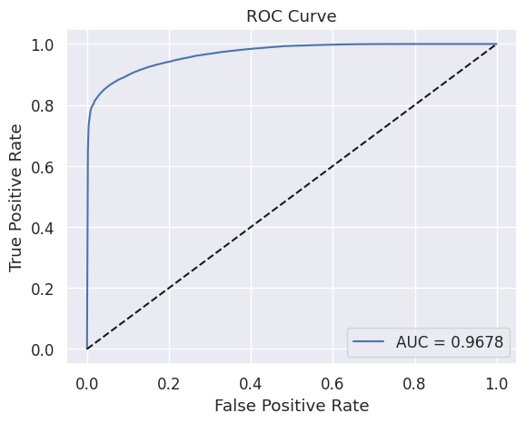

# Credit Analysis and Prediction

## Problem Statement
Credit companies face challenges in optimizing loan disbursement while minimizing credit risk. To address this, a predictive system is needed to classify loan applicants into two categories:
- Good Loan – Borrowers with a high likelihood of timely repayment
- Bad Loan – Borrowers with a high risk of default

This system enables the company to approve only low-risk loans, thereby reducing potential financial losses and improving the efficiency of credit decision-making.

Data Source: https://www.kaggle.com/datasets/adarshsng/lending-club-loan-data-csv

## Data Overview
The dataset utilized in this project comprises 466,285 entries with 75 features, encompassing information related to loan applicants, such as loan amounts, interest rates, verification statuses, credit histories, and payment statuses. This data exhibits a variety of variable types, including 46 numerical features (float64), 7 discrete numerical features (int64), and 22 categorical features (object).

## Data Cleaning
In the data cleaning stage, missing values and duplicate entries were addressed:

- Columns with 100% missing values → Removed, as they provide no useful information.
- Columns with 50% to <100% missing values → Filled with 0, assuming the absence of data represents a neutral/default state.
- Columns with 1% to <50% missing values:
  - Numerical features → Imputed with the median to maintain distribution integrity.
  - Categorical features → Imputed with the mode to preserve the most common category.
Duplicate entries → No duplicates were found in the dataset.

Effective data cleaning ensures data quality, reduces bias, and improves model performance.

## Data Leakage Preventing
During feature analysis, it was observed that several of the 75 features contain information that becomes available only after a loan has been approved. However, since our goal is to predict loan approval, these features would not be available during real-world model inference.

Including such features in training would lead to data leakage, where the model learns from future information, resulting in overly optimistic performance that does not generalize well to real-world scenarios.

To prevent this, features that capture post-loan approval information were dropped, including but not limited to:

- issue_d – Loan funding date
- total_pymnt – Total payments received to date
- total_rec_prncp – Principal received to date
- total_rec_int – Interest received to date
- total_rec_late_fee – Late fees received to date

By removing these features, we ensure that the model learns only from information available at the time of loan application, improving its reliability in real-world deployment.

## Feature Engineering

The dataset is split into 80% training data and 20% testing data to ensure effective model learning and evaluation. The final dataset dimensions after splitting are as follows: X_train: (191130, 32), Y_train: (191130, 1), X_test: (47783, 32), Y_test: (47783, 1). This split allows the model to learn from a sufficient amount of data while maintaining an independent test set for unbiased performance assessment. Also, all categorical features are encoded to ensure compatibility with the model before being used as input.

## Model and Evaluation

After data preparation, multiple Machine Learning classifiers were trained and evaluated, including Logistic Regression, XGBoost, Decision Tree, and Random Forest. Additionally, feature selection was applied using SelectKBest (k=10) to examine whether a reduced feature set could improve performance.

|Model|Accuracy|Precision|Recall|F1-Score|
|---|---|---|---|---|
|Logistic Regression|0.86|0.90|0.86|0.86|
|Logistic Regression (SelectKBest, k = 10)	|0.85	|0.90	|0.85	|0.86 |
|XGBoost	|0.90	|0.92	|0.90	|0.91 |
|XGBoost (SelectKBest, k = 10)	|0.89	|0.91	|0.89	|0.89 |
|Decision Tree	|0.87	|0.87	|0.87	|0.85 |
|Decision Tree (SelectKBest, k = 10)	|0.87	|0.87	|0.87	|0.85 |
|Random Forest	|0.91	|0.91	|0.91	|0.91 |
|Random Forest (SelectKBest, k = 10)	|0.91	|0.91	|0.91	|0.91 |

Among all models, Random Forest demonstrated the most consistent and well-balanced performance across all metrics (Accuracy, Precision, Recall, and F1-Score). Given the imbalance in the dataset, prioritizing precision and recall over mere accuracy is essential to minimize business risks associated with false negatives (missed high-risk borrowers) and false positives (incorrectly rejecting good borrowers).

The ROC curve further validates the robustness of the Random Forest model, achieving an AUC score of 0.9678, indicating excellent discriminative ability.

## Model Performance & Selection:

- Among multiple classifiers (Logistic Regression, Decision Tree, XGBoost, and Random Forest), Random Forest emerged as the best-performing model with balanced accuracy (91%), precision (91%), recall (91%), and F1-score (91%).
- Feature selection using SelectKBest (k=10) was explored, but results indicated that using the full feature set produced superior predictive performance.
- The ROC-AUC score of 0.9678 confirmed the model's strong ability to distinguish between low-risk and high-risk applicants.

